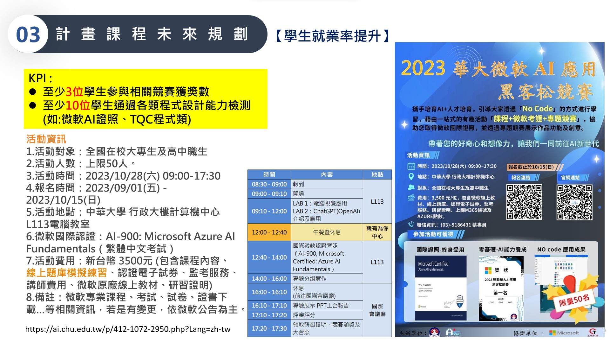
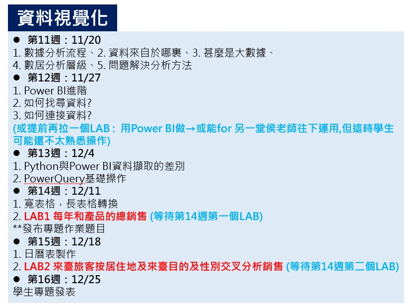

# 112教育部智慧創新計畫 
<a href="http://140.126.146.12:9090/GitHub2023/">112教育部智慧創新之GitHub學習平台</a>&nbsp;<a href="https://chat.openai.com/auth/login">技術諮詢</a> <table>   <tr>     <th>系級</th>     <th></th>     <th><a href="">學習履歷</a></th>     <th><a href="https://chat.openai.com/">好友</a></th>   </tr>   <tr>     <td><a href="https://mice.chu.edu.tw/index.php?Lang=zh-tw">會展系</a></td>     <td><a href="https://github.com/B11135036moco/Statistics.git">統計學</a></td>     <td><a href="https://github.com/B11135036moco/DataVisualization/tree/main/%E4%BD%9C%E6%A5%AD1/%E4%BD%9C%E6%A5%AD1">作業1</a></td>     <td>徐O瑜</td>   </tr>   <tr>     <td><a href="https://lm.chu.edu.tw/index.php?Lang=zh-tw">休閒組</a></td>     <td><a href="https://lm.chu.edu.tw/p/412-1040-117.php?Lang=zh-tw">實習</a></td>     <td><a href="https://github.com/B11135036moco/DataVisualization/tree/main/%E4%BD%9C%E6%A5%AD2/%E4%BD%9C%E6%A5%AD2">作業2</a></td>     <td>潘O蕙</td>   </tr>      <tr>     <td><a href="https://cmn-hant.overseas.ncnu.edu.tw/">僑生</a></td>     <td><a href="https://github.com/B11135036moco/Creative.git">111-2創意擂台暨永續行動方案競賽</a></td>     <td><a href="">其他</a></td>     <td></td>   </tr>   </table>  </img> </img> </img> 
